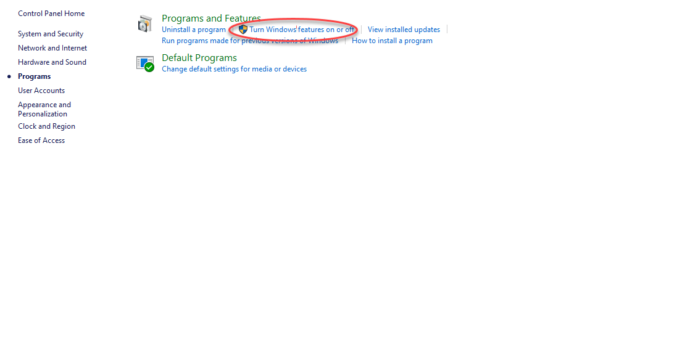
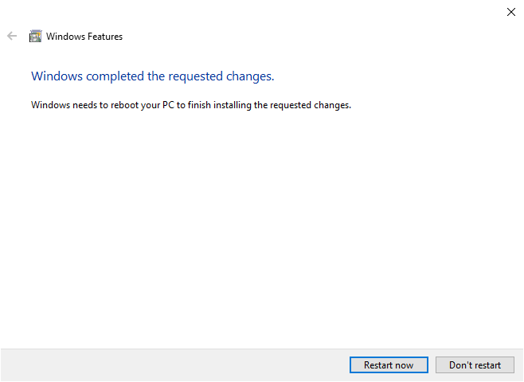
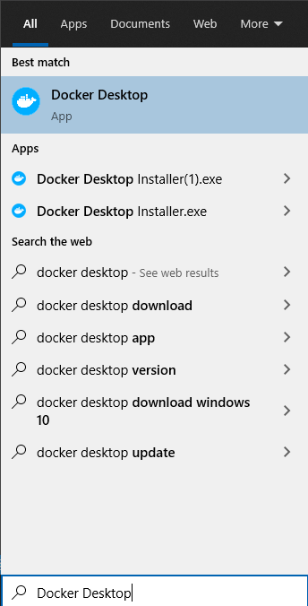
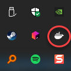
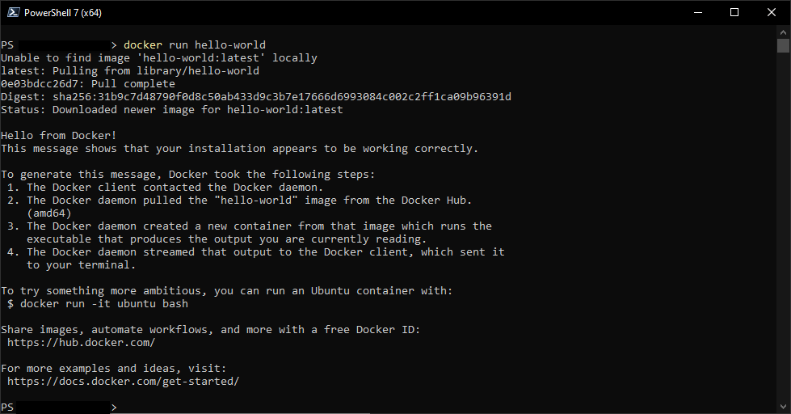

Instructions created Febuary 8th 2021

# Enable virtualization 
On Windows, Docker requires that you enable virtualization in the BIOS. 
On Intel platforms, the feature is called Intel VD-T. On AMD, it is called AMD-V. 

Lookup how to do this on your computers documentation. 

**Note: If you have VirtualBox or VMWare Workstation installed, it will not work after this installation**

# Install Windows Subsystem for Linux

1. Open Control Panel. Type in Control panel into the start menu, and click on the below icon.  

2. Click on Programs 

3. Click on 'Turn Windows Features On or Off' 

4. Scroll to the bottom and click on Windows Subsystem for Linux 

5. A popup will appear to install the feature, and ask you to restart. 

# Install Docker

1. Click on this link, and click 'Get Docker' [Link](https://hub.docker.com/editions/community/docker-ce-desktop-windows/) 

2. Once that is installed, open the installer. It'll ask to install components for WSL 2, make sure that is checked. When the install succeds, close the window 

3. Open docker from the start menu 

4. When the Docker icon in the tray stops moving up and down, open Powershell. 

5. To make sure Docker is installed properly, run `docker run hello-world`. Below is a picture of what should happen. 

