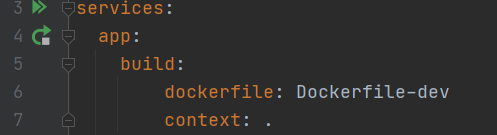
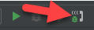
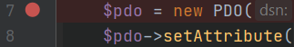
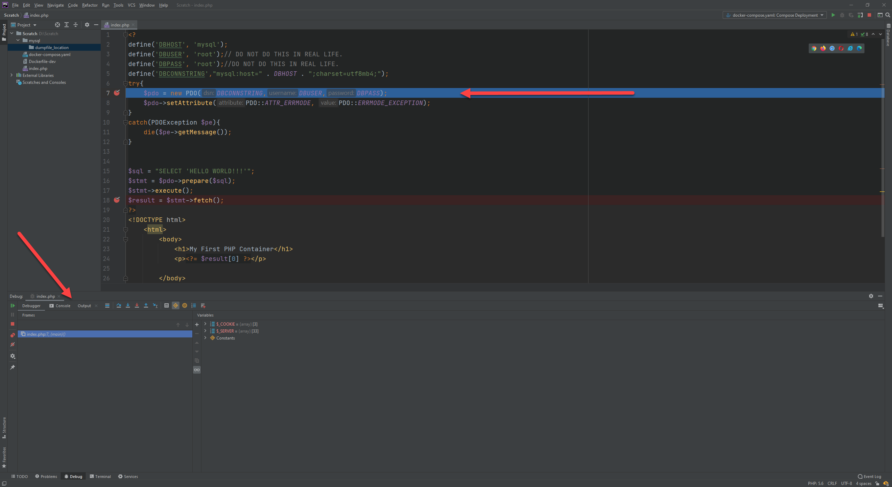

# Debug PHP container with XDebug and PHP Storm

## Open docker-compose.yaml in PHPStorm and click the double triangle button next to servicesIMPORTANT

Port 9000 needs to be free. On windows check by opening PowerShell and running `Get-NetTCPConnection | where Localport -eq 9000 | select Localport,OwningProcess`. XDebug will bind to that port.

**TL;DR MAKE SURE NOTHING IS BOUND TO PORT 9000**

## Instructions

If you use docker.io/kingsukhoi/phpwdebugger container, these are the instructions:

1. Open the folder with PHPStorm
2. Start docker-compose. Either
   * Open a terminal and run `docker-compose up -d`
   * Open docker-compose.yaml in PHPStorm and clikc the double triangle button next to services

     
3. On the top right, click the phone button. This will tell PHPStorm to start listening for connections   

   

4. Set a break point, click on the space right of the line number  

   

5. Access the php page in the browser
6. The page will appear to not load, and if you look at PHP Storm, the current line will be highlighted, and a debug window will open on the bottom.

   

Breakpoints can be set on any file, including files that have been included, and PHP statements in HTML.

