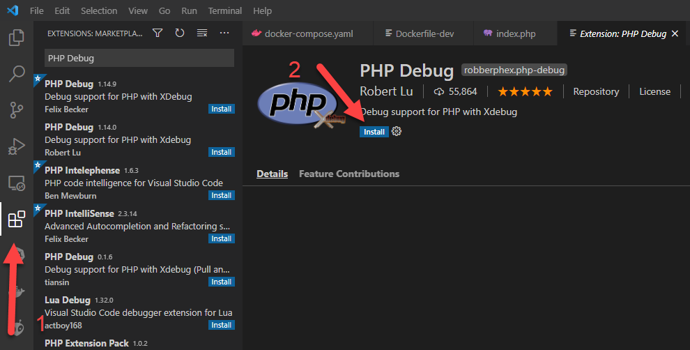
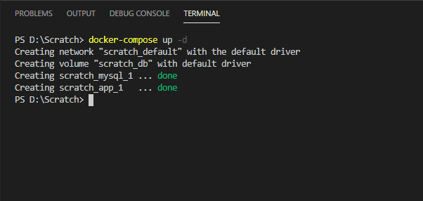
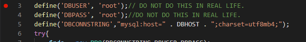
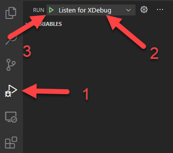
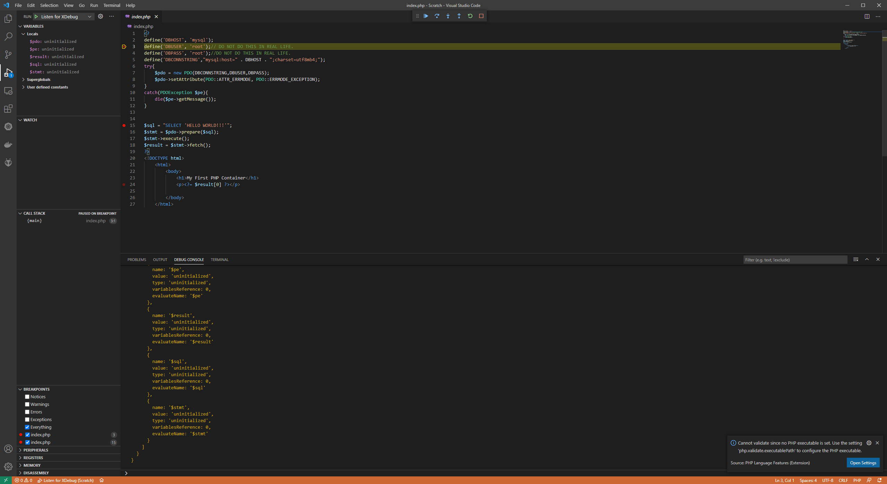

# Debug PHP container with XDebug and Visual Studio Code

1. Install the PHP Debug extention by Felix Becker.  


   

2. Open a terminal in the current folder, and run `docker-compose up -d`. In VSCode, you can press ``CTRL+```    


   

3. Create a folder called `.vscode`, and create a file called `launch.json`. In `launch.json` copy and paste the following content. If you are using git, commit this file.

   ```javascript
   {
    "version": "0.2.0",
    "configurations": [
        {
            "name": "Listen for XDebug",
            "type": "php",
            "request": "launch",
            "port": 9000,
            "log": true,
            "pathMappings": {
                "/var/www/html": "${workspaceRoot}"//This references the current directory. If you are using a src folder AND you mounted that folder in docker, add /src to the end of this line.
            }
        },
        {
            "name": "Launch currently open script",
            "type": "php",
            "request": "launch",
            "program": "${file}",
            "cwd": "${fileDirname}",
            "port": 9000
        }
    ]
   }
   ```

4. Set a break point.   
5. On the left hand toolbar: 1. Click on the triangle with the bug. On the top of that toolbar 2. Make sure the drop-down menu is set to `Listen for XDebug` 3. Press play.  
6. Open your php page, and VSCode should go into debugging mode. 

