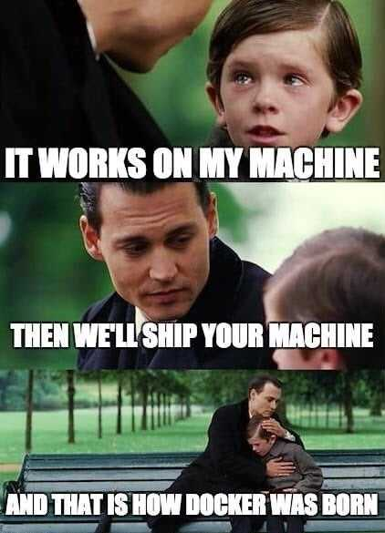

# Start Here

## What is this book

This book describes how to use Docker and Docker Compose for PHP and MySQL development environments. 

This book will walk you through how to:

* Create a container
* How to use docker-compose with a custom PHP container for debugging
* How to use the container to debug your application using PHPStorm or Visual Studio Code
* How to deploy your application to Google Cloud Platform using 2 methods \(pending\)

## What is Docker

This sums up Docker.

Docker is a way to package and environment and the app, isolate it from your computer, and run it the same way every time.

Docker is similar to a virtual machines like VMWare, in the sense that the processes that run in the container don't know about the system it runs on. However, how Docker and VMWare go about doing that is different, and out of scope for this document.

