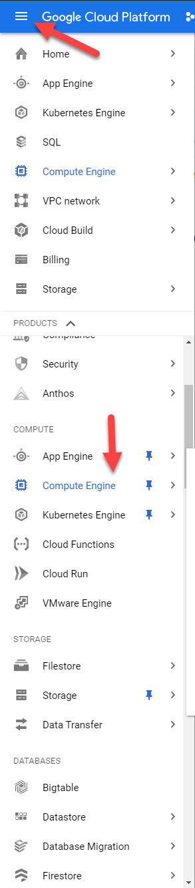
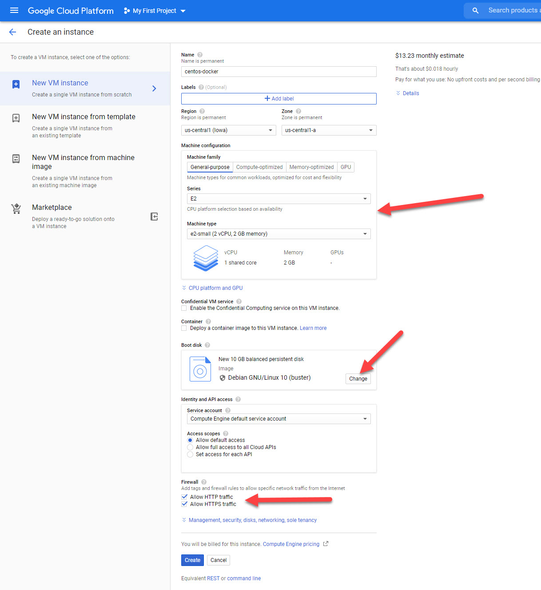
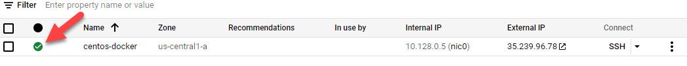
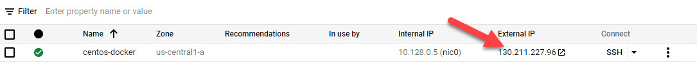

# Hosting on a VPS/Compute Engine \(Easiest\)

This method of hosting uses docker-compose to host your app. This is similar to how you started the application with docker-compose on your development machine. 

This tutorial will show you how to deploy the application and expose it to the internet.  

I will be using Centos 8 for this tutorial, but since the setup is fully containerized you can use any other Linux distribution.

## Start a VM in Google Compute Engine

1.Click on the menu on the top left, scroll down, and select compute engine

2. Click on Create Instance

3. Create a VM with the following settings

* Set the Machine Configuration to General-purpose, Series: E2, e2-small. Feel free to us a bigger one, but they cost more money
* Change the boot disk, by default you get Debian 10 and a 10gb boot disk, but you can change it if you want
* Under firewall, check Allow HTTP traffic, and Allow HTTPS Traffic.
* Click Create

4. Wait for the instance to start up

## Server Setup

1. Next to your instance, there is a button labeled SSH. Click on that and you will be given a browser shell
2. Go to the [Docker website ](https://docs.docker.com/engine/install/ubuntu/)below, and follow the instructions for your distribution. 
3. If you are using Centos, run `systemctl enable --now docker` 
4. Run `sudo usermod -aG docker $(whoami)` to 
5. Allow HTTP and HTTPS on the OS. GCP and other cloud providers use an external firewall that is separate from the VM. You can disable or allow the ports with the following commands
   * For Centos run and firewalld \(If the command isn't found, that is a good thing:

   1. `sudo firewall-cmd --zone=public --permanent --add-port=80/tcp`
   2. `sudo firewall-cmd --zone=public --permanent --add-port=443/tcp`
   3. `sudo firewall-cmd --reload`

   * For Ubuntu and UFW run \(If the command isn't found, that is a good thing\)

   1. `sudo ufw allow 80/tcp`
   2. `sudo ufw allow 443/udp`
6. Close the browser shell and re-open it before the next step.
7. Run `sudo curl -L "https://github.com/docker/compose/releases/download/1.28.5/docker-compose-$(uname -s)-$(uname -m)" -o /usr/local/bin/docker-compose; sudo chmod +x /usr/local/bin/docker-compose`

## Run your project

1. Download your project on the server.
2. Make a copy of your `docker-compose.yaml` file called `prod-compose.yaml`
   1. On Linux, run `cp docker-compose.yaml prod-compose.yaml`
3. For the php application, change the port configuration from `8080:80` to `80:80`
4. Enter the project directory, and run `docker-compose -f prod-compose.yaml up -d` . Due to the size of the VM, this will take a while.
5. \(Optional\) To setup a crude CI/CD setup run the following commands. They will run `git pull` from your repository every half hour. 
   1. Setup git so that it only fast forwards when it pulls. Run `git config pull.ff only`
   2. Get the full path of your code directory by running `pwd` in your code directory
   3. Run `crontab -e`, and in the editor that pop up add the following line `*/30 * * * * cd <path to the directory of your code>; git pull`
6. In the Compute Engine page, on the column that your VM is on there should be a row called External IP with an ip address. Click that to visit your application. Most browsers will use HTTPS by default, so you may need to explicitly type in `http://<yourip>/`.

